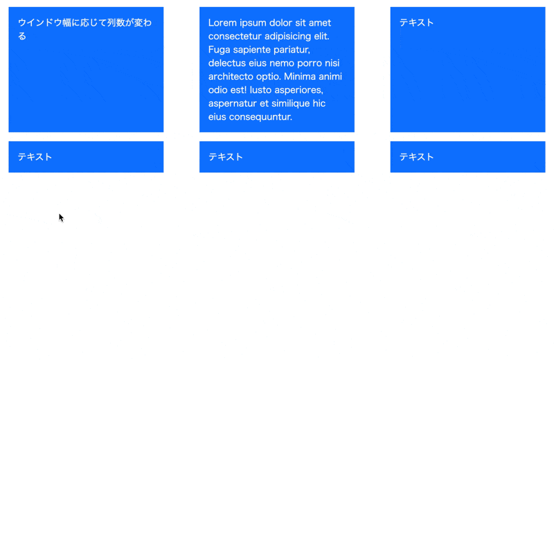
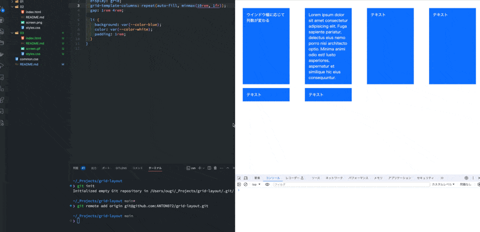

# タイルレイアウト

[サンプルページ](https://grid-layout-euh.pages.dev/03/)

- ウインドウ幅が狭まったら列数を減らす
- 要素が一定幅以下にならないようにする
- 要素の間には一定の間隔を空ける

## 幅に収まる数だけ並べる `repeat(auto-fit, xx)`

`grid-template-columns: repeat(auto-fit, minmax(200px, 1fr))` によって「要素が 200px 以上になることを保証しつつ、入るだけ横に並べる」ことが実現。

### `repeat` 関数

`grid-template-rows` `grid-template-columns` の中で使用できる関数。  
`repeat(3, 1fr)` は `1fr 1fr 1fr` と同じ。

### `auto-fit` `auto-fill` キーワード

どちらも **repeat 関数に設定** して、「入るだけ入れる」ことを指定するキーワード。  
`auto-fit` と `auto-fill` の違いは、幅に対して要素が少ない場合の挙動。

- `auto-fill` では、親要素にスペースが余る場合、空のグリッドが作られる。
- `auto-fit` では、親要素にスペースが余る場合、グリッドアイテムの幅が変わってスペースが埋められる。

`auto-fill` のサンプル

### gap

`gap: 1rem 4rem;` は `row-gap` `column-gap` の一括指定。
