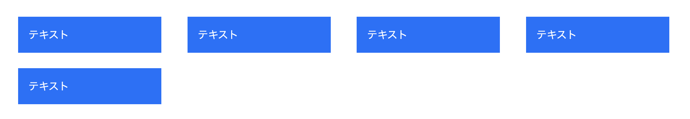

# 1 行のときはセンター、2 行以上のときは左寄せ

[サンプルページ](https://grid-layout-euh.pages.dev/04/)

`grid-template-columns: repeat(auto-fit, 22%)` とすることで、「要素が少ないときは枠を埋めない」ようにすることができる。 `auto-fill` だと空いたスペースが子 Grid で埋められる。

## 複数行のときにきれいに表示するポイント

`grid-template-columns` と `column-gap` を合計してちょうど 100%にすること。

`22 + 4 + 22 + 4 + 22 + 4 + 22` なので MAX は 4 列になる。
