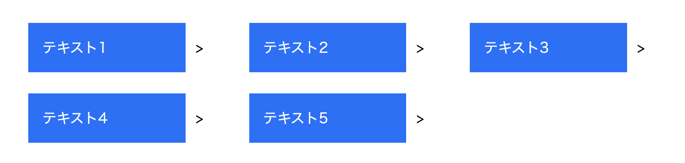

# 最後の列を飛ばして並べる

[サンプルページ](https://grid-layout-euh.pages.dev/05/)

例えば、4 つめのカードを並べると、矢印が wrapper の範囲外になっちゃうような場合。

## 配置される列を指定する `grid-column-start`

`grid-column-start` は子要素側に指定するプロパティで、その要素がどの列に配置されるかを指定する。

`steps > li:nth-child(4n)` この指定だと、テキスト 7 は折り返されないので指定に誤りがある。

このケースで `grid-column-start` を利用するのは誤りであって、素直に `repeat(3, 1fr);` としたほうがよい。
