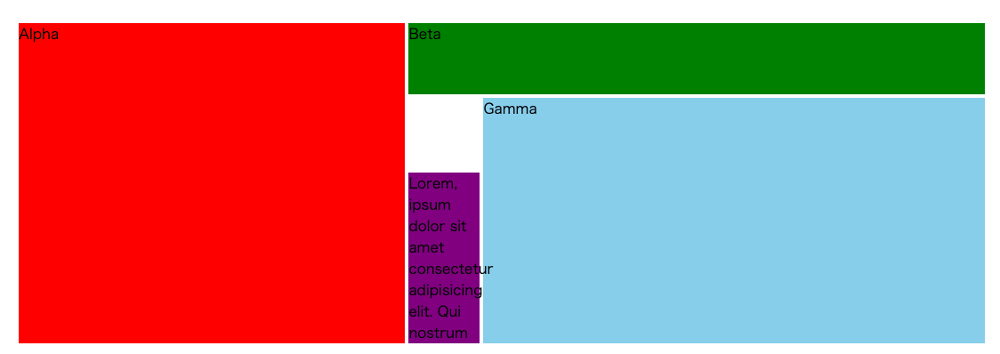

# 複雑なレイアウト

[サンプルページ](https://grid-layout-euh.pages.dev/06/)

## `grid-template` で一括指定

`grid-template` は、`grid-template-areas`、`grid-template-columns`、`grid-template-rows` の一括指定。

別々に記述するよりも、**対応する行・列が視覚的にわかりやすくなる**ので、直感的に記述できる。

- `80px` は grid の高さ
- `40% 80px 1fr` は幅

親要素（グリッドコンテナ）で `grid-template-areas` を指定してエリアに名前をつけ、子要素では `grid-area` によって、その要素が入るエリアを定義する。

`grid-template-area` のなにも要素が入らない（名前を付ける必要がない）エリアには `.` を記載しておく。

`grid-template-area` を切り替えることによって、ダイナミックにレイアウトを変更することも可能。
