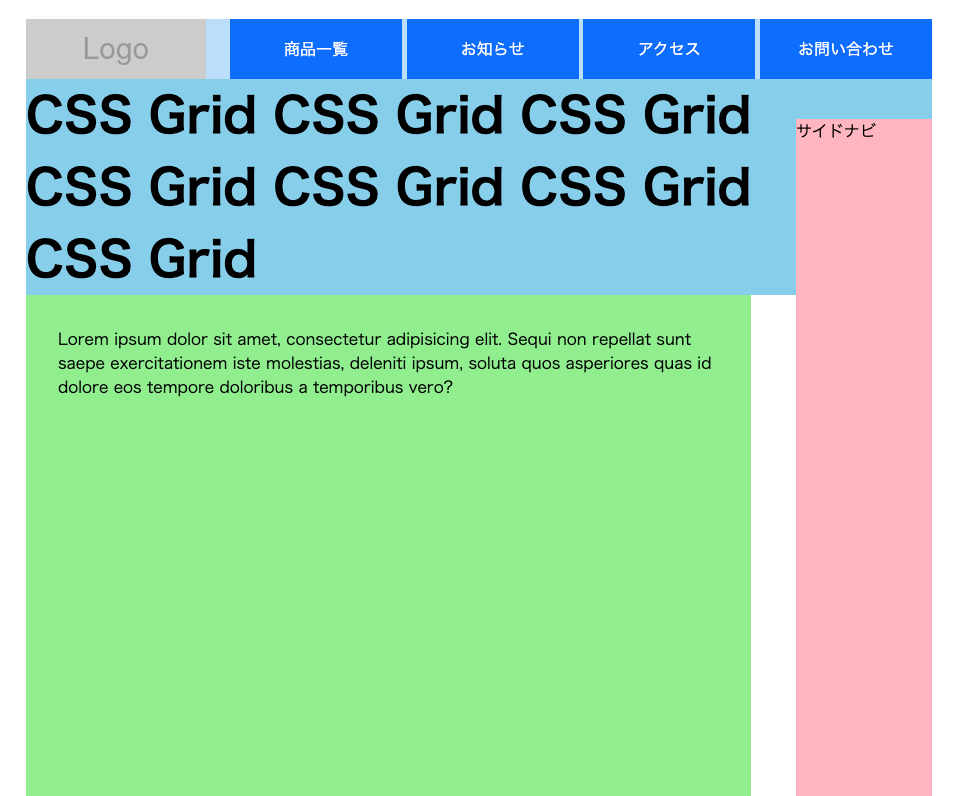

# ページ全体のレイアウト



[サンプルページ](https://grid-layout-euh.pages.dev/07/)

## 配置される行・列を指定する `grid-area`

`grid-row-start` `grid-column-start` `grid-row-end` `grid-column-end` の一括指定。

```css
grid-aria: 1 / 1 / span 2 / span 2;
```

これは、

```css
grid-row-start: 1;
grid-column-start: 1;
grid-row-end: span 2;
grid-column-end: span 2;
```

と同じ。

**「1 行目・1 列目から初めて、2 行分・2 列分使って配置します」**　ということになる。

`grid-area` で直接配置位置を指定することで、h1 とサイドナビを重ねている。  
値を省略する場合は（特別に指定しない場合）は`auto` キーワードを使える。
